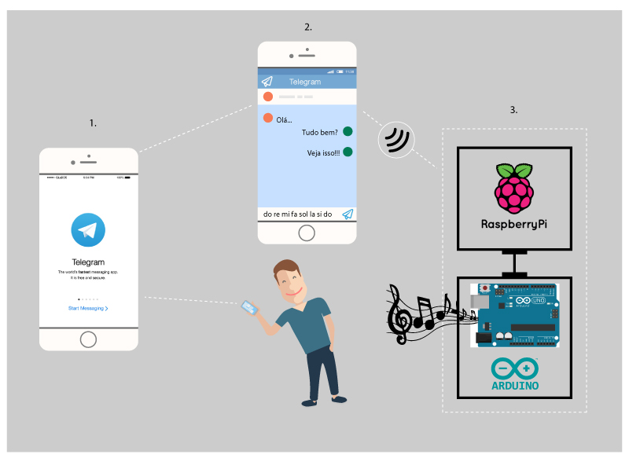
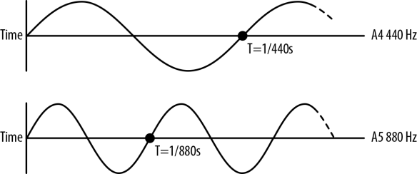
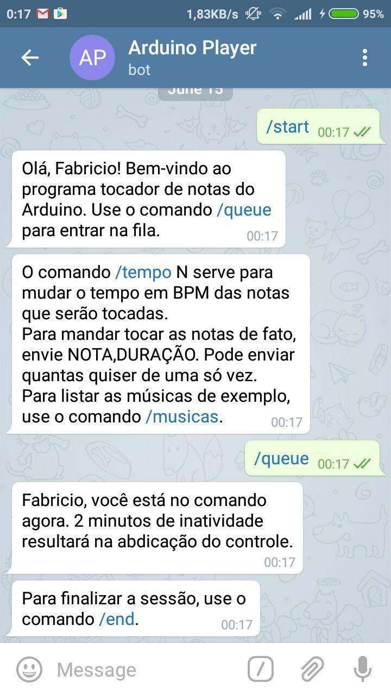
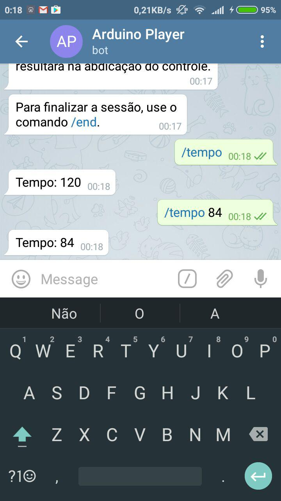
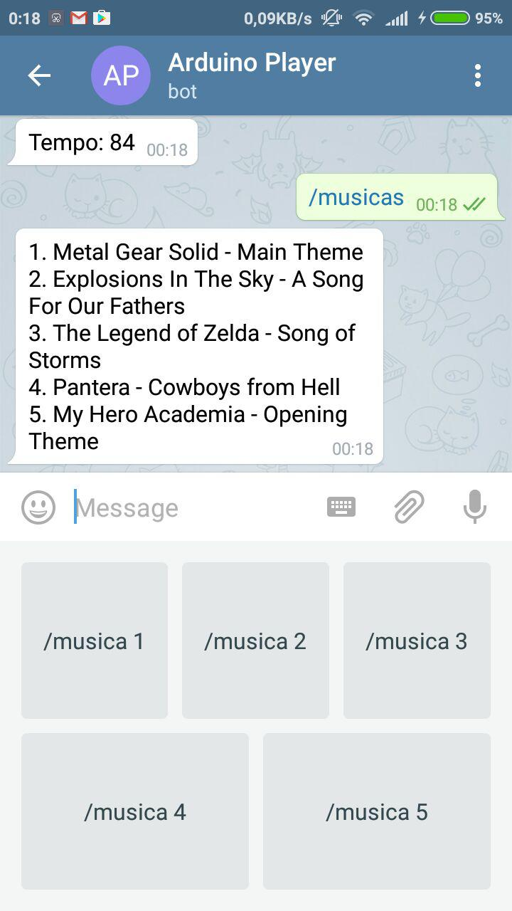
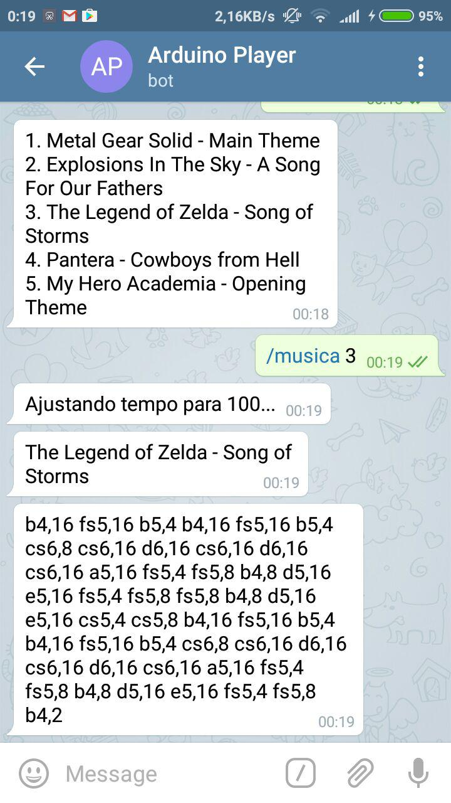
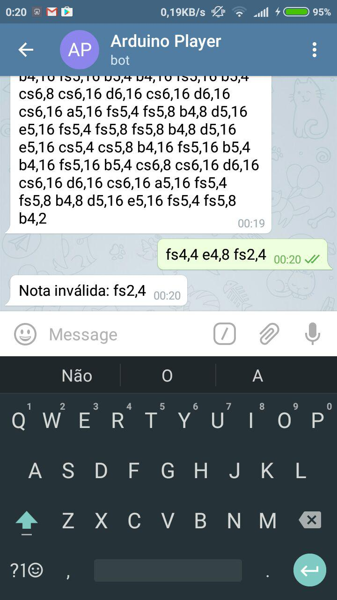
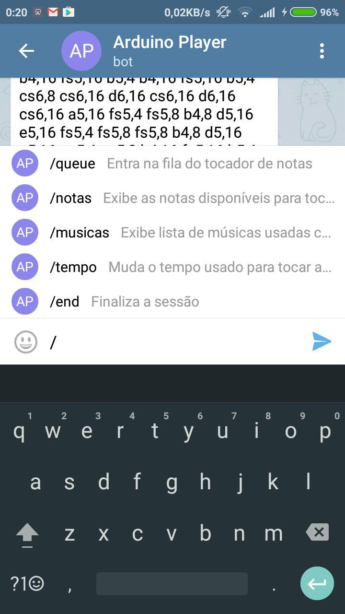

Arduino Note Player
===================

* Fabrício Werneck
* Rodolfo Dias

***

O Projeto
---------

Este projeto foi idealizado pelos alunos Rodolfo e Fabrício durante suas aulas
de *Física Experimental I* e teve como objetivo integrar o microprocessador
Arduino com o microcomputador Raspberry e o aplicativo mensageiro Telegram.
A ideia foi fazer com que fosse possível enviar notas musicais pelo mensageiro
e emitir seus sons através do Arduino. Por isso *Tocador de Notas Arduino*.

### Telegram
O Telegram é um aplicativo mensageiro que vem ganhando popularidade com o
passar do tempo, principalmente com todas as quedas que o WhatsApp vem
sofrendo.
Algumas características que exalta o Telegram são:

* Servidor em nuvem
  * Mensagens são armazenadas na nuvem
* Opção para criptografia ponto-a-ponto desde o seu início
  * Os chamados "chat secretos"
* Supergrupos de até 1000 membros (e aumentando o limite a cada *update*)
* Suporte a *stickers* (adesivos) nas mensagens
* Suporte nativo a bots

Desnecessário dizer, a atenção ao mensageiro foi fixada em razão aos bots. Com
a possibilidade de criar bots capazes de receber comandos e realizar uma ação
específica, só faltaria uma maneira de enviar estes comandos para o Arduino.
Foi aí que entrou o Raspberry.

### Raspberry Pi
O Raspberry é um computador "do tamanho de um cartão de crédito". Ele foi
criado pela fundação inglesa de mesmo nome com a finalidade de aprendizado nas
áreas de programação e computação.
Existem algumas opções de sistema operacional para ele, dentre elas várias
distribuições Linux e até uma versão menor do Windows 10.
Neste projeto, o Raspberry serviu como a *ponte* entre o Arduino e o Telegram.

A ligação Arduino-Raspberry-Telegram
------------------------------------

Ao criar um bot do Telegram, é possível acessar toda a interfacevde programação
dele, onde se descobre que utiliza-se de um sistema REST para enviar e receber
mensagens.
As funções *principais* dele, se assim podemos dizer, são `getUpdates` e
`sendMessage`. `getUpdates` nos dá uma lista com todas as últimas mensagens ao
bot enviadas, enquanto `sendMessage` envia mensagens aos usuários.

Utilizando a linguagem Python, foi escrito um programa em que `getUpdates` foi
usada extensivamente para receber toda e qualquer mensagem enviada pelos
usuários. Este programa é executado no Raspberry e é também responsável por
traduzir as notas recebidas para um formato compreensível ao Arduino, além de
enviá-las ao mesmo. A ligação entre Raspberry e Arduino é feita via serial
(USB).

Já o Arduino é composto por um circuito extremamente simples: dois fios, um em
uma porta digital e outro no terra (**GND**), ligados a um *Buzzer*. O Buzzer é
responsável por tocar as notas. O código do arduino recebe as notas através do
Serial em formato String no padrão `FREQUÊNCIA,DURAÇÃO` e as processa para que
haja a emissão dos sons pelo Buzzer. A `DURAÇÃO` é em milisegundos

***

A Física por trás disso tudo
----------------------------

Sendo esse um projeto sobre música - e, por sua vez, sons -, falar um pouco
sobre ondas sonoras é relevante. Sons nada mais são do que ondas sonoras que se
propagam pelo ambiente e, ao chegar no tímpano humano, provoca vibrações que
são percebidas pelo cérebro.
Cada som tem uma frequência em Hertz (`Hz`) e, quanto maior esta frequência,
mais agudo o som é. Pegando como exemplo a nota *Lá* em duas oitavas diferentes,
percebe-se que a oitava maior possui uma frequência maior à oitava menor. Não
só isso: pelo fato de a frequência maior ser exatamente o dobro da menor, temos
o mesmo som, diferenciadas apenas por sua agudeza.

***

Capturas de tela do bot
-----------------------

  
*Inicializando o bot*
***

  
Ajustando o *tempo* em BPM
***

  

  
Consultando as músicas de exemplo disponíveis
***

  
Feedback de nota inválida ao tentar tocar
***

  
Listando comandos disponíveis
